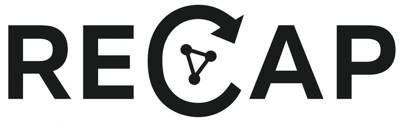

# RECAP (Reproducible Experiment Capture and Provenance)

<p align="center">
  
</p>

A scientific framework for reproducible experiment capture, tracking, and metadata management.

## Overview

RECAP is a Python framework that captures **experimental provenance** using a SQL database backend (via SQLAlchemy 2.0+). It provides:

- Pydantic validators
- A DSL builder API
- SQLAlchemy ORM persistence
- A unified provenance graph connecting campaigns -> runs -> steps -> resources

## Resources

In RECAP any trackable entity is called a **Resource**. A resource can be a physical item (samples, plates, robots), a digital item (raw detector files, processed datasets), or a logical item (intermediate computation results). Resources are treated as first-class objects: they have identity, metadata, lineage, and hierarchical structure.

### Resource Hierarchy

Resources may contain child resources. For example, a 96-well plate includes 96 wells:

```
Plate
 ├── A01
 ├── A02
 ├── ...
 └── H12
```

Each child is also a resource with its own attributes.

Example: creating a plate template with child wells:

```python
with client.build_resource_template("96 Well Plate", ["container", "plate"]) as t:
    t.add_properties({
        "dimensions": [
            {"name": "rows", "type": "int", "default": 8},
            {"name": "columns", "type": "int", "default": 12},
        ]
    })

    for row in "ABCDEFGH":
        for col in range(1, 13):
            t.add_child(f"{row}{col:02d}", ["container", "well"])\
             .add_properties({
                 "capacity": [
                     {"name": "volume_uL", "type": "float", "default": 360.0}
                 ]
             })\
             .close_child()
```

### Properties and Property Groups

Resources carry metadata organized into **PropertyGroup** containers.

Example: modifying well content after instantiating a plate:

```python
with client.build_resource("Library Plate A", "96 Well Plate") as plate:
    for well in plate.resource.children:
        well.properties["content"].values["catalog_id"] = ""
        well.properties["content"].values["SMILES"] = ""
```

## ProcessRun

A `ProcessRun` captures the execution of a workflow that manipulates resources.

- Each run contains a series of steps.
- Each step contains parameters.
- Resources are assigned into slots defined by the process template.
- Runs form the core provenance trail.

```
Campaign
  └── ProcessRun
         ├── Step 1
         ├── Step 2
         └── Step 3
```

## Campaign

A **Campaign** stores the scientific context:

- Proposal identifiers
- SAF/regulatory details
- Arbitrary metadata
- All `ProcessRun` objects belonging to the project

Creating a campaign:

```python
campaign = client.create_campaign(
    name="Beamline Proposal 4321",
    proposal_id="4321",
    saf_id="A12-7"
)
```

## Templates and Types

Templates must be created before instantiating resources or process runs.

### Resource Templates

A `ResourceTemplate` defines canonical property groups, expected child resources, and semantic `ResourceType` tags.

Example:

```python
with client.build_resource_template(
    "CLS3922-96", ["container", "plate", "vendor_cls3922"]
) as t:
    t.add_properties({
        "dimensions": [
            {"name": "rows", "type": "int", "default": 8},
            {"name": "cols", "type": "int", "default": 12},
        ]
    })
```

### Process Templates

A `ProcessTemplate` is a multi-step workflow with slots for resources.

Example definition:

```python
from recap.db.process import Direction

with client.build_process_template("Simple Heat/Shake/Transfer", "1.0") as pt:
    pt.add_resource_slot("source", "container", Direction.input)
    pt.add_resource_slot("dest", "container", Direction.output)

    # Step 1
    pt.add_step("Heat")\
      .param_group("heat")\
      .add_attribute("temperature", "float", "C", 0)\
      .add_attribute("duration_min", "float", "min", 0)\
      .close_group()\
      .bind_slot("vessel", "source")\
      .close_step()

    # Step 2
    pt.add_step("Shake")\
      .param_group("shake")\
      .add_attribute("rpm", "int", "", 0)\
      .add_attribute("time_min", "float", "min", 0)\
      .close_group()\
      .bind_slot("vessel", "source")\
      .close_step()

    # Step 3
    pt.add_step("Transfer")\
      .param_group("transfer")\
      .add_attribute("volume_ml", "float", "mL", 0)\
      .close_group()\
      .bind_slot("from", "source")\
      .bind_slot("to", "dest")\
      .close_step()
```

## Instantiating a ProcessRun

```python
with client.build_process_run(
    "Run 001",
    "Heating and shaking test run",
    "Simple Heat/Shake/Transfer",
    "1.0"
) as run:
    pass
```

Assigning resources:

```python
run.assign_resource("source", tubeA)
run.assign_resource("dest", tubeB)
```

Updating step parameters:

```python
step = run.steps[0]
step.parameters["heat"].values["temperature"] = 80
step.parameters["heat"].values["duration_min"] = 5
```

## Relating Resources, Campaigns, and Processes

A resource enters a campaign once assigned to any process run belonging to it. You may traverse provenance in both directions:

```python
sample.campaigns
campaign.resources
run.resources
resource.process_runs
```

## Steps and Parameters

Steps are created from `StepTemplate` definitions and carry parameter groups, for example:

```python
step.parameters["heat"].values["temperature"]
step.parameters["transfer"].values["volume_ml"]
```

## Entity Relationships In Practice

1. Model inventory using `ResourceTemplate` objects.
2. Define workflows using `ProcessTemplate` and `StepTemplate` objects.
3. Execute experiments by creating `Campaign` -> `ProcessRun` and assigning resources.
4. Query provenance from any direction:

```
campaign -> runs -> steps -> parameters
resource -> assignments -> runs -> campaigns
```

## Example: End-to-End Mini Workflow

```python
# 1. Create template
with client.build_resource_template("Tube", ["container"]) as t:
    t.add_properties({"dims": [{"name": "volume_uL", "type": "float", "default": 1500}]})

# 2. Instantiate resources
tubeA = client.create_resource("Tube A", "Tube")
tubeB = client.create_resource("Tube B", "Tube")

# 3. Campaign
campaign = client.create_campaign("Buffer Prep", "BP-001", "0")

# 4. Process template
with client.build_process_template("Transfer 1mL", "1.0") as pt:
    pt.add_resource_slot("source", "container", Direction.input)
    pt.add_resource_slot("dest", "container", Direction.output)
    pt.add_step("transfer")\
      .param_group("p")\
      .add_attribute("volume_uL", "float", "uL", 0)\
      .close_group()\
      .bind_slot("src", "source")\
      .bind_slot("dst", "dest")\
      .close_step()

# 5. Run
with client.build_process_run("Run 1", "", "Transfer 1mL", "1.0") as run:
    run.assign_resource("source", tubeA)
    run.assign_resource("dest", tubeB)
    run.steps[0].parameters["p"].values["volume_uL"] = 1000
```

## Querying Data

RECAP exposes a small Query DSL on top of the configured backend (SQLAlchemy or another adapter) so that you can express provenance-oriented queries in a fluent, chainable style.

The query builder lives on the client as `client.query_maker()` and exposes type-specific entry points:

- `campaigns()` -> `CampaignQuery`
- `process_runs()` -> `ProcessRunQuery`
- `resources()` -> `ResourceQuery`
- `resource_templates()` -> `ResourceTemplateQuery`

Under the hood, these all use a common `BaseQuery` and a backend-provided `.query(model, spec)` implementation. The `QuerySpec` object carries filters, predicates, ordering, preloads, and pagination options down to the backend. Query objects are immutable: every operation like `filter` or `include` returns a new query instance.

### Getting a QueryDSL Handle

Assuming you have a configured client:

```python
from recap.client.base_client import RecapClient

with RecapClient(url="sqlite:///recap.db") as client:
    qm = client.query_maker()

    # Query entry points
    campaigns = qm.campaigns()
    runs = qm.process_runs()
    resources = qm.resources()
    templates = qm.resource_templates()
```

### Basic Filtering

The simplest way to filter is with `filter(**kwargs)`, which translates into backend-specific filter expressions.

List all campaigns with a given proposal id:

```python
campaigns = (
    client.query_maker()
    .campaigns()
    .filter(proposal="4321")
    .all()
)

for c in campaigns:
    print(c.id, c.name)
```

Fetch a single campaign by name (or `None` if not found):

```python
campaign = (
    client.query_maker()
    .campaigns()
    .filter(name="Beamline Proposal 4321")
    .first()
)

if campaign is None:
    raise RuntimeError("No such campaign")
```

Counting results:

```python
n_runs = (
    client.query_maker()
    .process_runs()
    .count()
)
print("Total runs:", n_runs)
```

### Filtering Resource Templates by Type

`ResourceTemplateQuery` adds a convenience helper `filter_by_types` for semantic resource types:

```python
xtal_plate_templates = (
    client.query_maker()
    .resource_templates()
    .filter_by_types(["xtal_plate"])
    .all()
)

for tmpl in xtal_plate_templates:
    print(tmpl.name, tmpl.types)
```

This corresponds directly to the examples in the workflow section where we create templates tagged with types like `["container", "xtal_plate", "plate"]` or `["library_plate"]`.

### Eager Loading Related Data with `include`

Queries can preload related entities via the `include` helper. Each `include` translates to a string path that the backend understands (e.g., for SQLAlchemy that might become `joinedload` or `selectinload`). The type-specific queries expose more ergonomic methods:

- `CampaignQuery.include_process_runs()`
- `ProcessRunQuery.include_steps(include_parameters: bool = False)`
- `ProcessRunQuery.include_resources()`
- `ResourceQuery.include_template()`

Example: load campaigns and their process runs in one go:

```python
campaigns = (
    client.query_maker()
    .campaigns()
    .include_process_runs()
    .all()
)

for c in campaigns:
    print("Campaign:", c.name)
    for run in c.process_runs:
        print("  Run:", run.name)
```

#### Example: load runs with steps and parameter groups

```python
runs = (
    client.query_maker()
    .process_runs()
    .include_steps(include_parameters=True)
    .all()
)

for run in runs:
    print(f"Run: {run.name}")
    for step_num, step in enumerate(run.steps):
        print(f"\tStep {step_num}: {step.name}")
        for pg_num, (param_group_name, param_group) in enumerate(step.parameters.items()):
            print(f"\t\tGroup {pg_num}: {param_group_name}")
            for param_name, param_value in param_group.values.items():
                print(f"\t\t\t{param_name} : {param_value}")
```

#### Example: load resources with their template

```python
library_plates = (
    client.query_maker()
    .resources()
    .filter(types__names_in=["library_plate"])
    .include_template()
    .all()
)

for plate in library_plates:
    print("Resource:", plate.name)
    print("  Template:", plate.template.name)
```

### Provenance Queries

#### "Which campaigns touched this sample?"

```python
sample = (
    client.query_maker()
    .resources()
    .filter(name="Sample 42")
    .first()
)

if sample is None:
    raise RuntimeError("Sample not found")

runs = (
    client.query_maker()
    .process_runs()
    .filter(resources__id=sample.id)
    .include_steps()
    .all()
)

campaign_ids = {run.campaign_id for run in runs}
campaigns = (
    client.query_maker()
    .campaigns()
    .filter(id__in=list(campaign_ids))
    .all()
)

for c in campaigns:
    print("Campaign:", c.name)
```

#### "Show me a full tree for a campaign"

```python
campaign = (
    client.query_maker()
    .campaigns()
    .filter(name="Buffer Prep")
    .include_process_runs()
    .first()
)

if campaign is None:
    raise RuntimeError("No such campaign")

runs = (
    client.query_maker()
    .process_runs()
    .filter(campaign_id=campaign.id)
    .include_steps(include_parameters=True)
    .include_resources()
    .all()
)

for run in runs:
    print("Run:", run.name)
    print("  Resources:")
    for assignment in run.resources:
        print("   -", assignment.resource.name, f"({assignment.role})")

    print("  Steps:")
    for step in run.steps:
        print("   -", step.name)
        for group in step.parameters:
            for attr in group.values:
                print(f"       {group.group_name}.{attr.name} = {attr.value}")
```

### Pagination and Ordering

All query types expose generic helpers:

- `where(*predicates)`
- `order_by(*orderings)`
- `limit(value)`
- `offset(value)`

The exact predicate and ordering objects are backend-specific, but the chaining API is stable.

Example: fetch the 10 most recent runs:

```python
from recap.db.models import ProcessRun  # or use backend-specific fields

recent_runs = (
    client.query_maker()
    .process_runs()
    .order_by(ProcessRun.created_at.desc())
    .limit(10)
    .all()
)

for run in recent_runs:
    print(run.created_at, run.name)
```

### Implementation Note

Internally, each query constructs a `QuerySpec`:

```python
class QuerySpec(BaseModel):
    filters: dict[str, Any] = {}
    predicates: Sequence[Any] = ()
    orderings: Sequence[Any] = ()
    preloads: Sequence[str] = ()
    limit: int | None = None
    offset: int | None = None
```

Your backend adapter receives the model type and `QuerySpec` and is responsible for translating that into SQLAlchemy queries or other data sources. This separation keeps the public Query DSL stable even if the backend implementation changes.

## Roadmap

- REST API backend
- Web UI for campaign/process management
