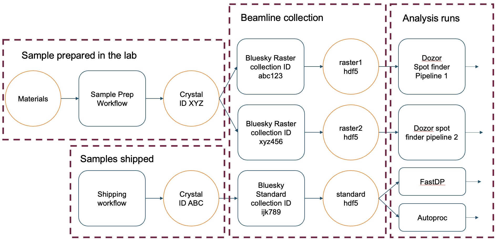
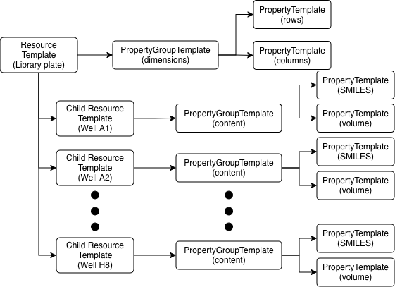
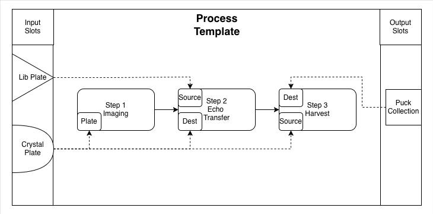
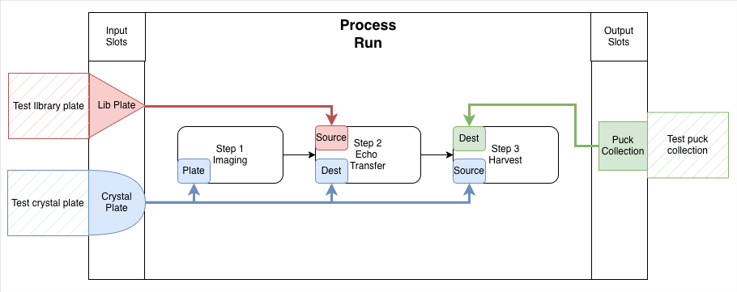

# RECAP (Reproducible Experiment Capture and Provenance)

<p align="center">
  
</p>

A scientific framework for reproducible experiment capture, tracking, and metadata management.

## Overview

RECAP is a Python framework that captures **experimental provenance** using a SQL database backend (via SQLAlchemy 2.0+). It provides:

- Pydantic validators
- A DSL builder API
- SQLAlchemy ORM persistence
- A unified provenance graph

## Table of Contents

- [Overview](#overview)
- [What Recap does](#what-recap-does)
- [What its _not_ meant for](#what-its-_not_-meant-for)
- [Installation](#installation)
- [Getting started](#getting-started)
- [Core concepts](#core-concepts)
- [Resources](#resources)
  - [Resource Hierarchy](#resource-hierarchy)
  - [Resource Template](#resource-template)
  - [Properties and Property Groups](#properties-and-property-groups)
- [ProcessTemplates and ProcessRuns](#processtemplates-and-processruns)
- [Instantiating a ProcessRun](#instantiating-a-processrun)
- [Adding child resources and steps during runtime](#adding-child-resources-and-steps-during-runtime)
- [Querying Data](./docs/querying_data.md)

## What Recap does

Lifecycle of experiments can be arbitrarily long, managing high throughput experiment plans and data capture is difficult and relationships between phases of experiments can be complex.

Recap provides an “experiment data management” framework which unifies different stages of an experiment under one scalable provenance rich backbone.
It allows a complete audit trail of experiments and answers questions like, "Who ran it?", "When and with what settings?"

Recap is ideal for high throughput experiments and models physical and digital artifacts and defines relationships between them

## What its _not_ meant for

- Recap is not an Electronic Lab Notebook (ELN) or Lab Inventory Management Software (LIMS), although you can write an application on top of Recap.
- Recap does not deal with instrument control
- Does not perform computations, analyses

## Installation

Recap is available on PyPI. Install with:
```
pip install pyrecap
```

## Getting started

As of Dec 2025, Recap clients connect directly to SQLite databases; a REST API backend is on the roadmap.

To create and connect to a temporary SQLite database:
```python
from recap.client import RecapClient

client = RecapClient.from_sqlite() 
print(client.database_path) # print path of your database
```

If you want a database at a specific path, pass it in. You can also point at an existing database the same way:

```python
client = RecapClient.from_sqlite("/path/to/database.db")
```

## Core concepts

Data provenance is captured using a combination of `Resources` and `ProcessRuns`. A `Resource` is any trackable entity such as samples, raw detector data, or processed data. A `ProcessRun` is a workflow that describe interactions with `Resources`. Typically, `Resources` are inputs and outputs to a `ProcessRun`. We can chain multiple `ProcessRuns` together either by using the output `Resource` of one process as the input to another, or re-using the same `Resource` as inputs to different `ProcessRuns`. The figure below illustrates how this chain can be created at the MX beamline for a particular set of samples

<p align="center">
  
</p>

Circles represent `Resources` and the rounded boxes represent `ProcessRuns`. Different phases of the experiment process is represented by dashed boxes. By chaining resources together, one can query the database for information such as, given a processing result file, what were the sample preparation conditions? This kind of data provenance is particularly useful to build statistical or machine-learning models to optimize sample preparation or even data acquisition parameters. The next few sections will dive deeper into the way one can use Recap to define [Resources](#resources) and [ProcessRuns](#processtemplates-and-processruns)


## Resources

As mentioned previously, in RECAP any trackable entity is called a **Resource**. A resource can be a physical item (samples, plates, robots), a digital item (raw detector files, processed datasets), or a logical item (intermediate computation results). Think of resources as first-class objects: they carry identity, metadata, lineage, and can be nested inside each other.

### Resource Hierarchy

Resources may contain child resources. For example, a 96-well plate includes 96 wells:

```
Plate
 ├── A01
 ├── A02
 ├── ...
 └── H12
```

Each child is also a resource with its own attributes. Before creating a resource you define a `ResourceTemplate`, which is the canonical blueprint for what gets instantiated.


### Resource Template

Example: creating a plate template with child wells:

```python
with client.build_resource_template(name="Xtal Plate",
                                    type_names=["container", "plate", "xtal_plate"]) as template_builder:
    for row in "ABC":
        for col in range(1, 4):
            template_builder.add_child(f"{row}{col:02d}", ["container", "well"]).close_child()
```

Here we build or update a template in the database. A template needs a unique name and one or more `type_names` (tags) so it can be matched to slots in a workflow (`ProcessRun`). The example also shows adding child templates (`well`).


### Properties and Property Groups

Resources can carry metadata organized into groups of related properties.


Example: Here we add properties to the plate template. The group is called `dimensions` and contains two parameters, `rows` and `columns`. Each entry declares the data `type` and a `default` value; add a `unit` if it matters. We follow up by adding wells as child resource templates, and add properties specific to wells.

```python
with client.build_resource_template(name="Library Plate",
                                    type_names=["container", "plate", "library_plate"]) as template_builder:
    template_builder.add_properties({
        "dimensions": [
            {"name": "rows", "type": "int", "default": 3},
            {"name": "columns", "type": "int", "default": 4},
        ]
    })

    for row in "ABC":
        for col in range(1, 4):
            template_builder.add_child(f"{row}{col:02d}", ["container", "well"])\
             .add_properties({
                "status": [
                    {"name": "used", "type": "bool", "default": False},
                ],
                "content": [
                     {"name": "catalog_id", "type": "str", "default": ""},
                     {"name": "smiles", "type": "str", "default": ""},
                     {"name": "sequence", "type": "int", "default": col},
                     {"name": "volume", "type": "float", "default": 10.0, "unit": "uL", "metadata": {"min": 0, "max": 20.0}},
                 ]
             })\
             .close_child()
```

The following table shows the available data types that can be assigned to properties. Metadata is an optional dictionary that can be provided for additional data validation

#### AttributeValue types and metadata

| Value Type | Python Type | Metadata keys (optional)                     |
|------------|-------------|----------------------------------------------|
| `int`      | `int`       | `min`, `max`                                 |
| `float`    | `float`     | `min`, `max`                                 |
| `bool`     | `bool`      | _(none)_                                     |
| `str`      | `str`       | _(none)_                                     |
| `datetime` | `datetime`  | _(none)_                                     |
| `array`    | `list`      | _(none)_                                     |
| `enum`     | `str`       | `choices` (list of allowed string values)    |

Visualizing ResourceTemplates, PropertyGroups and Properties

<p align="center">
  
</p>

96 well plates are not the only resources you can model, you can also model an NXMX HDF5 file ([example](docs/resource_examples.md#nexus-hdf5-files)), UR5 robot ([example](docs/resource_examples.md#ur5-robot)) or even a scientist ([example](docs/resource_examples.md#scientist)).


### Resources

Once the template is defined, you can create a Resource instance. Instantiation also materializes any child resources from the template. For example,

```python

plate = client.create_resource(name="Plate A", template_name="Library Plate")

```

creates a Resource from the `Library Plate` template; children are created automatically and properties are initialized with their defaults.

The returned object is a Pydantic model, well suited for inspection and local changes, but database changes must go through the client. You can either:

1. Call `create_resource` (shown above) to get a default instance, or
2. Use a builder to tweak values or add extra children before persisting:

```python

with client.build_resource(name="Plate B", template_name="Library Plate") as resource_builder:
    resource = resource_builder.get_model()
    # Make changes to the resource and its default parameters
    resource.children["A01"].properties["status"].values["used"] = True
    # Then update the builder with the newly edited object
    resource_builder.set_model(resource) 

```

**Note**: Values in the database can _only_ be changed via builders. Editing the Pydantic model changes your local copy, not the database. Builders are context managers that manage the transaction; if validation fails, the context rolls back safely.

**Note**: `create_resource` generates the resource with default values and returns a Pydantic model. `build_resource` opens a builder so you can modify values before commit.

You can also re-use an existing builder,

```python

with resource_builder:
    # This is the same builder as the one created above
    # Any changes here modify the resource called "Plate B"
    ...
    
```

If you already have a Pydantic model (from a query or `create_resource`), you can build from it:

```python

with client.build_resource(resource_id=resource.id) as rb2:
    rb2.set_model(resource)
    
```

Every time the context manager is initialized, the builder pulls the latest data for the model from the database. In the example above, the builder updates itself from the database.

## ProcessTemplates and ProcessRuns

A `ProcessTemplate` captures a workflow that manipulates resources.

- Each template contains an ordered series of steps.
- Each step has parameters (similar to resource properties).
- Resources are assigned into slots defined by the template.
- A `ProcessRun` is an instance of a `ProcessTemplate`.
- ProcessRuns form the core provenance trail.

The figure illustrates the structure of a ProcessTemplate:

<p align="center">
  
</p>

This template consists of 3 steps. Each step is connected to the next in the order of execution using solid arrows:

- Imaging step: plate wells are imaged under a microscope.
- Echo Transfer step: the Echo 525 acoustic liquid handler moves liquid, typically well-to-well across plates.
- Harvest step: crystals are harvested from a plate and transferred into a pin that sits in a puck.

On the left of the Process Template are the input resource slots; only resources of type `library_plate` and `crystal_plate` can be assigned there. The right side shows the output slot, which must be a `puck_collection`.

Assigned resources play different roles per step. In `Echo Transfer`, the `library_plate` is the `source` and the `crystal_plate` is the `destination`. In `Harvesting`, the `crystal_plate` becomes the `source` and the `puck_collection` is the `destination`. The dotted arrows indicate the association of a `resource_slot` to each `role`. When a `ProcessRun` starts, Recap wires the assigned resources to the appropriate steps based on the template definition.

Before implementing the ProcessTemplate shown in the figure, add the Resource templates the process needs: the crystal plate, a collection of pucks, a puck template, and a pin (sample holder) that sits inside a puck:

```python
# Crystal plate template
with client.build_resource_template(name="Crystal Plate",
                                    type_names=["container", "plate", "xtal_plate"]) as template_builder:
    template_builder.add_properties({
        "dimensions": [
            {"name": "rows", "type": "int", "default": 3},
            {"name": "columns", "type": "int", "default": 4},
        ]
    })

    for row in "ABC":
        for col in range(1, 4):
            template_builder.add_child(f"{row}{col:02d}", ["container", "well"])\
             .add_properties({
                "well_map": [
                     {"name": "well_pos_x", "type": "int", "default": 0},
                     {"name": "well_pos_y", "type": "int", "default": 0},
                     {"name": "echo", "type": "str", "default": ""},
                     {"name": "shifter", "type": "str", "default": ""},
                 ]
             })\
             .close_child()

# Puck collection template
with client.build_resource_template(
    name="Puck Collection", type_names=["container", "puck_collection"]
) as pc:
    pass

# Puck template
with client.build_resource_template(
    name="Puck", type_names=["container", "puck"]
) as pkb:
    pkb.add_properties({
        "details": [
             {"name": "type", "type": "str", "default": "unipuck"},
             {"name": "capacity", "type": "int", "default": 16},
        ]
    })
    puck_template = pkb.get_model()

# Pin template
with client.build_resource_template(
    name="Pin", type_names=["container", "pin"]
) as pin:
    pin.add_properties({
        "mount": [
            {"name": "position", "type": "int", "default": 0},
            {"name": "sample_name", "type": "str", "default": ""},
            {"name": "departure", "type": "datetime", "default": None},
        ]
    })
```

Once the resource templates exist, you can create the process template. You can technically define it earlier, but the resource types it references must already exist.


```python
from recap.utils.general import Direction
with client.build_process_template("PM Workflow", "1.0") as pt:
    (
        pt.add_resource_slot("library_plate", "library_plate", Direction.input)
        .add_resource_slot("xtal_plate", "xtal_plate", Direction.input)
        .add_resource_slot("puck_collection", "puck_collection", Direction.output)
    )
    (
        pt.add_step(name="Imaging")
        .add_parameters({
             "drop": [
                {"name": "position", "type": "enum", "default": "u",
                "metadata":{"choices": {"u": {"x": 0, "y": 1}, "d": {"x": 0, "y": -1}}},
                }]
            })
            .bind_slot("plate", "xtal_plate")
            .close_step()
    )
    (
        pt.add_step(name="Echo Transfer")
        .add_parameters({
            "echo": [
                {"name": "batch", "type": "int", "default": 1},
                {"name": "volume", "type": "float", "default": 25.0, "unit": "nL"},
            ]
        })
        .bind_slot("source", "library_plate")
        .bind_slot("dest", "xtal_plate")
        .close_step()
    )
    (
        pt.add_step(name="Harvesting")
        .add_parameters({
            "harvest": [
                {"name": "arrival", "type": "datetime"},
                {"name": "departure", "type": "datetime"},
                {"name": "lsdc_name", "type": "str"},
                {"name": "harvested", "type": "bool", "default": False},
            ]
        })
        .bind_slot("source", "xtal_plate")
        .bind_slot("dest", "puck_collection")
        .close_step()
    )

```

**Note**: For a given database, it is only required to define a template _once_. Templates are reusable definitions of a resource or process.

Before we initialize instances of these containers or create a process run, we must associate the current session with a `Campaign`.

A **Campaign** stores the scientific context:

- Proposal identifiers
- SAF/regulatory details
- Arbitrary metadata
- All `ProcessRun` objects belonging to the project

```
Campaign
  └── ProcessRun
         ├── Step 1
         ├── Step 2
         └── Step 3
```

Creating a campaign:

```python
campaign = client.create_campaign(
    name="Experiment visit on 12/12/25",
    proposal="399999",
    saf="123",
    metadata={"arbitrary_data": True}
)
```

## Instantiating a ProcessRun

After you set or create a campaign, any ProcessRun or Resource is automatically associated with it. The snippet below creates a ProcessRun tied to that campaign. Recap will raise an exception if you forget to set a campaign first.

```python

test_xtal_plate = client.create_resource(name="Test crystal plate", template_name="Crystal Plate", version="1.0")

test_library_plate = client.create_resource(name="Test library plate", template_name="Library Plate", version="1.0")

test_puck_collection = client.create_resource("Test puck collection", "Puck Collection")

with client.build_process_run(
    name="Run 001",
    description="Fragment screening test run",
    template_name="PM Workflow",
    version="1.0"
) as prb:
    prb.assign_resource("library_plate", test_library_plate)
    prb.assign_resource("xtal_plate", test_xtal_plate)
    prb.assign_resource("puck_collection", test_puck_collection)
    process_run = prb.get_model()
```

The figure below shows the resources we created. Resources are assigned to the appropriate slots and wired to their steps.

<p align="center">
  
</p>


## Adding child resources and steps during runtime

Sometimes templates can't predict every child resource or step ahead of time. For example, a puck collection may have an arbitrary number of pucks. To add children at runtime, use the `add_child` method in the resource builder:

```python

with client.build_resource(resource_id=test_puck_collection.id) as pcb:
    pcb.add_child(name="Puck01", template_name="Puck", template_version="1.0")
    
```

Or if you have a reference to the template id:

```python

with client.build_resource(resource_id=test_puck_collection.id) as pcb:
    pcb.add_child(name="Puck01", template_id=puck_template.id)

```

Child steps can be added dynamically in cases where details are unknown ahead of time. For example, to capture an Echo Transfer step from 1 well of the library plate to the crystal plate we can do the following

```python

with client.build_process(process_id=process_run.id) as prb:
    # Generate a pydantic model for the child step
    echo_transfer_step = process_run.steps["Echo Transfer"].generate_child()
    # Update its values
    echo_transfer_step.parameters.echo.values.batch = 2
    echo_transfer_step.parameters.echo.values.volume = 20
    echo_transfer_step.resources["source"] = test_library_plate.children["A1"]
    echo_transfer_step.resources["dest"] = test_xtal_plate.children["A1a"]
    # Add it to the database
    prb.add_child_step(echo_transfer_step)

```

To query the database, checkout the [Querying Data page](./docs/querying_data.md)

## Roadmap

- REST API backend
- CLI
- Web UI for campaign/process management
