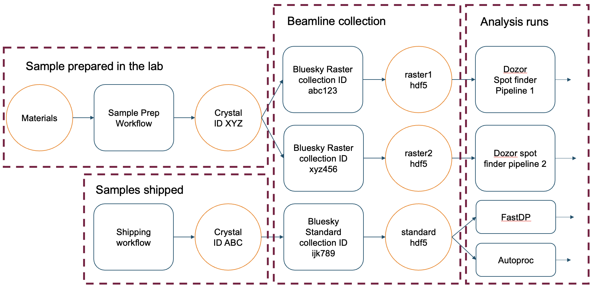
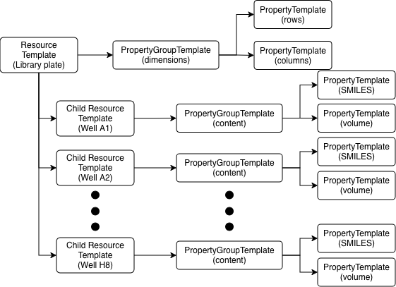
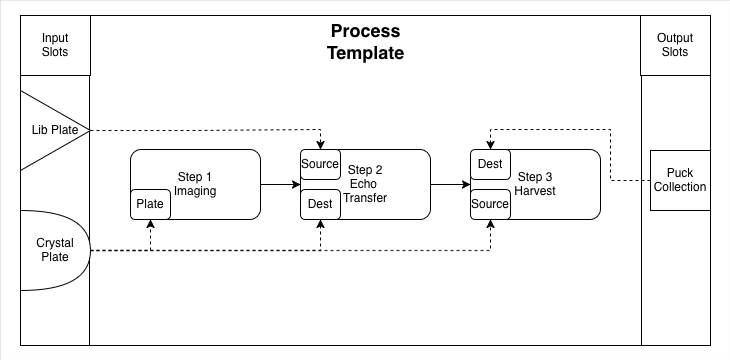
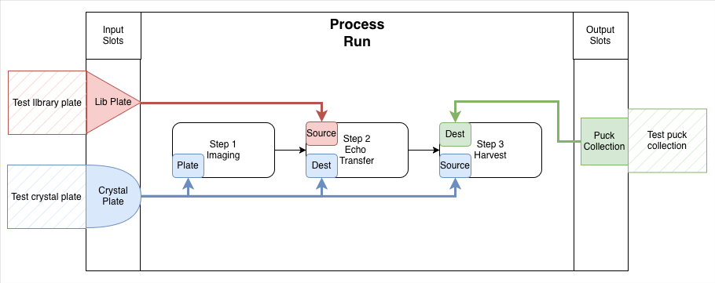

# RECAP (Reproducible Experiment Capture and Provenance)

<p align="center">
  
</p>

A scientific framework for reproducible experiment capture, tracking, and metadata management.

## Overview

RECAP is a Python framework that captures **experimental provenance** using a SQL database backend (via SQLAlchemy 2.0+). It provides:

- Pydantic validators
- A DSL builder API
- SQLAlchemy ORM persistence
- A unified provenance graph

## Table of Contents

- [Overview](#overview)
- [What Recap does](#what-recap-does)
- [What its _not_ meant for](#what-its-_not_-meant-for)
- [Installation](#installation)
- [Getting started](#getting-started)
- [Core concepts](#core-concepts)
- [Resources](#resources)
  - [Resource Hierarchy](#resource-hierarchy)
  - [Resource Template](#resource-template)
  - [Properties and Property Groups](#properties-and-property-groups)
- [ProcessTemplates and ProcessRuns](#processtemplates-and-processruns)
- [Instantiating a ProcessRun](#instantiating-a-processrun)
- [Adding child resources and steps during runtime](#adding-child-resources-and-steps-during-runtime)
- [Querying Data](#querying-data)
  - [Getting a QueryDSL Handle](#getting-a-querydsl-handle)
  - [Basic Filtering](#basic-filtering)
  - [Filtering Resource Templates by Type](#filtering-resource-templates-by-type)
  - [Filtering Resources by Properties](#filtering-resources-by-properties)
  - [Filtering Process Runs by Step Parameters](#filtering-process-runs-by-step-parameters)
  - [Eager Loading Related Data](#eager-loading-related-data-with-include)
  - [Accessing Assigned Resources](#accessing-assigned-resources)
  - [Accessing Resource Children](#accessing-resource-children)
  - [Provenance Queries](#provenance-queries)
  - [Pagination and Ordering](#pagination-and-ordering)
- [Performance Guide](#performance-guide)
- [Roadmap](#roadmap)

## What Recap does

Lifecycle of experiments can be arbitrarily long, managing high throughput experiment plans and data capture is difficult and relationships between phases of experiments can be complex.

Recap provides an "experiment data management" framework which unifies different stages of an experiment under one scalable provenance rich backbone.
It allows a complete audit trail of experiments and answers questions like, "Who ran it?", "When and with what settings?"

Recap is ideal for high throughput experiments and models physical and digital artifacts and defines relationships between them.

## What its _not_ meant for

- Recap is not an Electronic Lab Notebook (ELN) or Lab Inventory Management Software (LIMS), although you can write an application on top of Recap.
- Recap does not deal with instrument control
- Does not perform computations, analyses

## Installation

Recap is available on PyPI. Install with:
```
pip install pyrecap
```

## Getting started

As of Dec 2025, Recap clients connect directly to SQLite databases; a REST API backend is on the roadmap.

To create and connect to a temporary SQLite database:
```python
from recap.client import RecapClient

client = RecapClient.from_sqlite()
print(client.database_path)  # print path of your database
```

If you want a database at a specific path, pass it in. You can also point at an existing database the same way:

```python
client = RecapClient.from_sqlite("/path/to/database.db")
```

## Core concepts

Data provenance is captured using a combination of `Resources` and `ProcessRuns`. A `Resource` is any trackable entity such as samples, raw detector data, or processed data. A `ProcessRun` is a workflow that describes interactions with `Resources`. Typically, `Resources` are inputs and outputs to a `ProcessRun`. We can chain multiple `ProcessRuns` together either by using the output `Resource` of one process as the input to another, or re-using the same `Resource` as inputs to different `ProcessRuns`. The figure below illustrates how this chain can be created at the MX beamline for a particular set of samples.

<p align="center">
  
</p>

Circles represent `Resources` and the rounded boxes represent `ProcessRuns`. Different phases of the experiment process is represented by dashed boxes. By chaining resources together, one can query the database for information such as, given a processing result file, what were the sample preparation conditions? This kind of data provenance is particularly useful to build statistical or machine-learning models to optimize sample preparation or even data acquisition parameters. The next few sections will dive deeper into the way one can use Recap to define [Resources](#resources) and [ProcessRuns](#processtemplates-and-processruns).


## Resources

As mentioned previously, in RECAP any trackable entity is called a **Resource**. A resource can be a physical item (samples, plates, robots), a digital item (raw detector files, processed datasets), or a logical item (intermediate computation results). Think of resources as first-class objects: they carry identity, metadata, lineage, and can be nested inside each other.

### Resource Hierarchy

Resources may contain child resources. For example, a 96-well plate includes 96 wells:

```
Plate
 ├── A01
 ├── A02
 ├── ...
 └── H12
```

Each child is also a resource with its own attributes. Before creating a resource you define a `ResourceTemplate`, which is the canonical blueprint for what gets instantiated.

**Note**: `resource.children` is a `dict[str, ResourceSchema]` keyed by the child resource's name — not a list. Use `resource.children["A01"]` for direct access or `.values()` to iterate all children. See [Accessing Resource Children](#accessing-resource-children).

### Resource Template

Example: creating a plate template with child wells:

```python
with client.build_resource_template(name="Xtal Plate",
                                    type_names=["container", "plate", "xtal_plate"]) as template_builder:
    for row in "ABC":
        for col in range(1, 4):
            template_builder.add_child(f"{row}{col:02d}", ["container", "well"]).close_child()
```

Here we build or update a template in the database. A template needs a unique name and one or more `type_names` (tags) so it can be matched to slots in a workflow (`ProcessRun`). The example also shows adding child templates (`well`).


### Properties and Property Groups

Resources can carry metadata organized into groups of related properties.

Example: Here we add properties to the plate template. The group is called `dimensions` and contains two parameters, `rows` and `columns`. Each entry declares the data `type` and a `default` value; add a `unit` if it matters. We follow up by adding wells as child resource templates, and add properties specific to wells.

```python
with client.build_resource_template(name="Library Plate",
                                    type_names=["container", "plate", "library_plate"]) as template_builder:
    template_builder.add_properties({
        "dimensions": [
            {"name": "rows", "type": "int", "default": 3},
            {"name": "columns", "type": "int", "default": 4},
        ]
    })

    for row in "ABC":
        for col in range(1, 4):
            template_builder.add_child(f"{row}{col:02d}", ["container", "well"])\
             .add_properties({
                "status": [
                    {"name": "used", "type": "bool", "default": False},
                ],
                "content": [
                     {"name": "catalog_id", "type": "str", "default": ""},
                     {"name": "smiles", "type": "str", "default": ""},
                     {"name": "sequence", "type": "int", "default": col},
                     {"name": "volume", "type": "float", "default": 10.0, "unit": "uL", "metadata": {"min": 0, "max": 20.0}},
                 ]
             })\
             .close_child()
```

The following table shows the available data types that can be assigned to properties. Metadata is an optional dictionary that can be provided for additional data validation.

#### AttributeValue types and metadata

| Value Type | Python Type | Metadata keys (optional)                     |
|------------|-------------|----------------------------------------------|
| `int`      | `int`       | `min`, `max`                                 |
| `float`    | `float`     | `min`, `max`                                 |
| `bool`     | `bool`      | _(none)_                                     |
| `str`      | `str`       | _(none)_                                     |
| `datetime` | `datetime`  | _(none)_                                     |
| `array`    | `list`      | _(none)_                                     |
| `enum`     | `str`       | `choices` (list of allowed string values)    |

Visualizing ResourceTemplates, PropertyGroups and Properties

<p align="center">
  
</p>

96 well plates are not the only resources you can model, you can also model an NXMX HDF5 file ([example](docs/resource_examples.md#nexus-hdf5-files)), UR5 robot ([example](docs/resource_examples.md#ur5-robot)) or even a scientist ([example](docs/resource_examples.md#scientist)).


### Resources

Once the template is defined, you can create a Resource instance. Instantiation also materializes any child resources from the template. For example,

```python
plate = client.create_resource(name="Plate A", template_name="Library Plate")
```

creates a Resource from the `Library Plate` template; children are created automatically and properties are initialized with their defaults.

#### Accessing and updating property values

Each attribute group on a resource is a `PropertySchema`. Attributes are accessed by dot (slug) or bracket (slug or original name). Each attribute is an `AttributeValueSchema` with a `.value` and a `.unit`. Its `str()` renders `"<value><unit>"`:

```python
well = plate.children["A01"]

# Read value and unit — dot (slug) or bracket (slug or original name)
well.properties.content.volume.value        # 10.0
well.properties.content.volume.unit         # "uL"
str(well.properties.content.volume)         # "10.0uL"

well.properties.content["volume"].value     # 10.0  (bracket by slug)
well.properties.content["Volume"].value     # 10.0  (bracket by original name)

# .get() — accepts slug or original name, returns None when missing
well.properties.content.get("volume").value  # 10.0

# Set value (unit stays unchanged — mutates in-place)
well.properties.content.volume = 8.5        # dot setter
well.properties.content["volume"] = 8.5     # bracket setter — same behaviour

# Set unit
well.properties.content.volume.unit = "uL"

# Set a unit-free attribute
well.properties.content.smiles = "CCO"
well.properties.content["smiles"] = "CCO"   # equivalent
```

The returned object is a Pydantic model, well suited for inspection and local changes, but database changes must go through the client. You can either:

1. Call `create_resource` (shown above) to get a default instance, or
2. Use a builder to tweak values or add extra children before persisting:

```python
with client.build_resource(name="Plate B", template_name="Library Plate") as resource_builder:
    resource = resource_builder.get_model()
    # Make changes to the resource and its default parameters
    resource.children["A01"].properties.status.used = True
    # Then update the builder with the newly edited object
    resource_builder.set_model(resource)
```

**Note**: Values in the database can _only_ be changed via builders. Editing the Pydantic model changes your local copy, not the database. Builders are context managers that manage the transaction; if validation fails, the context rolls back safely.

**Note**: `create_resource` generates the resource with default values and returns a Pydantic model. `build_resource` opens a builder so you can modify values before commit.

**Note**: Builders support `on_existing="warn" | "raise" | "silent"` (default `"warn"`). Use `"silent"` to reuse existing objects without warning noise in idempotent pipelines. See the [Performance Guide](#on_existing-silent-for-known-existing-records) for the cost of `"silent"` on existing records.

You can also re-use an existing builder:

```python
with resource_builder:
    # This is the same builder as the one created above
    # Any changes here modify the resource called "Plate B"
    ...
```

To update a known existing resource by its ID (avoids a name-based lookup):

```python
with client.build_resource(resource_id=resource.id) as rb:
    m = rb.get_model()
    m.properties.status.used = True
    rb.set_model(m)
```

#### Calling `build_property_model()` on queried resources

Resources returned from `create_resource()` have their property access model built automatically. For resources obtained from **queries**, whether `build_property_model()` is called automatically depends on the load strategy used:

| Load strategy | `build_property_model()` called? |
|---|---|
| `load="full"` on a resource query | Yes — automatically |
| `include(["properties"])` on a resource query | **No** — call `resource.build_property_model()` manually before accessing `resource.properties.group.attr.value` |
| `include_resources()` on a process run query | Yes — automatically, including for child resources |

```python
# If you used include(["properties"]) on a resource query:
for resource in results:
    resource.build_property_model()          # required before property access
    print(resource.properties.dimensions.rows.value)
```

Every time the context manager is initialized, the builder pulls the latest data for the model from the database. In the example above, the builder updates itself from the database.

## ProcessTemplates and ProcessRuns

A `ProcessTemplate` captures a workflow that manipulates resources.

- Each template contains an ordered series of steps.
- Each step has parameters (similar to resource properties).
- Resources are assigned into slots defined by the template.
- A `ProcessRun` is an instance of a `ProcessTemplate`.
- ProcessRuns form the core provenance trail.

The figure illustrates the structure of a ProcessTemplate:

<p align="center">
  
</p>

This template consists of 3 steps. Each step is connected to the next in the order of execution using solid arrows:

- Imaging step: plate wells are imaged under a microscope.
- Echo Transfer step: the Echo 525 acoustic liquid handler moves liquid, typically well-to-well across plates.
- Harvest step: crystals are harvested from a plate and transferred into a pin that sits in a puck.

On the left of the Process Template are the input resource slots; only resources of type `library_plate` and `crystal_plate` can be assigned there. The right side shows the output slot, which must be a `puck_collection`.

Assigned resources play different roles per step. In `Echo Transfer`, the `library_plate` is the `source` and the `crystal_plate` is the `destination`. In `Harvesting`, the `crystal_plate` becomes the `source` and the `puck_collection` is the `destination`. The dotted arrows indicate the association of a `resource_slot` to each `role`. When a `ProcessRun` starts, Recap wires the assigned resources to the appropriate steps based on the template definition.

Before implementing the ProcessTemplate shown in the figure, add the Resource templates the process needs: the crystal plate, a collection of pucks, a puck template, and a pin (sample holder) that sits inside a puck:

```python
# Crystal plate template
with client.build_resource_template(name="Crystal Plate",
                                    type_names=["container", "plate", "xtal_plate"]) as template_builder:
    template_builder.add_properties({
        "dimensions": [
            {"name": "rows", "type": "int", "default": 3},
            {"name": "columns", "type": "int", "default": 4},
        ]
    })

    for row in "ABC":
        for col in range(1, 4):
            template_builder.add_child(f"{row}{col:02d}", ["container", "well"])\
             .add_properties({
                "well_map": [
                     {"name": "well_pos_x", "type": "int", "default": 0},
                     {"name": "well_pos_y", "type": "int", "default": 0},
                     {"name": "echo", "type": "str", "default": ""},
                     {"name": "shifter", "type": "str", "default": ""},
                 ]
             })\
             .close_child()

# Puck collection template
with client.build_resource_template(
    name="Puck Collection", type_names=["container", "puck_collection"]
) as pc:
    pass

# Puck template
with client.build_resource_template(
    name="Puck", type_names=["container", "puck"]
) as pkb:
    pkb.add_properties({
        "details": [
             {"name": "type", "type": "str", "default": "unipuck"},
             {"name": "capacity", "type": "int", "default": 16},
        ]
    })
    puck_template = pkb.get_model()

# Pin template
with client.build_resource_template(
    name="Pin", type_names=["container", "pin"]
) as pin:
    pin.add_properties({
        "mount": [
            {"name": "position", "type": "int", "default": 0},
            {"name": "sample_name", "type": "str", "default": ""},
            {"name": "departure", "type": "datetime", "default": None},
        ]
    })
```

Once the resource templates exist, you can create the process template. You can technically define it earlier, but the resource types it references must already exist.

```python
from recap.utils.general import Direction
with client.build_process_template("PM Workflow", "1.0") as pt:
    (
        pt.add_resource_slot("library_plate", "library_plate", Direction.input)
        .add_resource_slot("xtal_plate", "xtal_plate", Direction.input)
        .add_resource_slot("puck_collection", "puck_collection", Direction.output)
    )
    (
        pt.add_step(name="Imaging")
        .add_parameters({
             "drop": [
                {"name": "position", "type": "enum", "default": "u",
                "metadata":{"choices": {"u": {"x": 0, "y": 1}, "d": {"x": 0, "y": -1}}},
                }]
            })
            .bind_slot("plate", "xtal_plate")
            .close_step()
    )
    (
        pt.add_step(name="Echo Transfer")
        .add_parameters({
            "echo": [
                {"name": "batch", "type": "int", "default": 1},
                {"name": "volume", "type": "float", "default": 25.0, "unit": "nL"},
            ]
        })
        .bind_slot("source", "library_plate")
        .bind_slot("dest", "xtal_plate")
        .close_step()
    )
    (
        pt.add_step(name="Harvesting")
        .add_parameters({
            "harvest": [
                {"name": "arrival", "type": "datetime"},
                {"name": "departure", "type": "datetime"},
                {"name": "lsdc_name", "type": "str"},
                {"name": "harvested", "type": "bool", "default": False},
            ]
        })
        .bind_slot("source", "xtal_plate")
        .bind_slot("dest", "puck_collection")
        .close_step()
    )
```

**Note**: For a given database, it is only required to define a template _once_. Templates are reusable definitions of a resource or process.

Before we initialize instances of these containers or create a process run, we must associate the current session with a `Campaign`.

A **Campaign** stores the scientific context:

- Proposal identifiers
- SAF/regulatory details
- Arbitrary metadata
- All `ProcessRun` objects belonging to the project

```
Campaign
  └── ProcessRun
         ├── Step 1
         ├── Step 2
         └── Step 3
```

Creating a campaign:

```python
campaign = client.create_campaign(
    name="Experiment visit on 12/12/25",
    proposal="399999",
    saf="123",
    metadata={"arbitrary_data": True}
)
```

## Instantiating a ProcessRun

After you set or create a campaign, any ProcessRun or Resource is automatically associated with it. The snippet below creates a ProcessRun tied to that campaign. Recap will raise an exception if you forget to set a campaign first.

```python
test_xtal_plate = client.create_resource(name="Test crystal plate", template_name="Crystal Plate", version="1.0")
test_library_plate = client.create_resource(name="Test library plate", template_name="Library Plate", version="1.0")
test_puck_collection = client.create_resource("Test puck collection", "Puck Collection")

with client.build_process_run(
    name="Run 001",
    description="Fragment screening test run",
    template_name="PM Workflow",
    version="1.0"
) as prb:
    prb.assign_resource("library_plate", test_library_plate)
    prb.assign_resource("xtal_plate", test_xtal_plate)
    prb.assign_resource("puck_collection", test_puck_collection)
    process_run = prb.get_model()
```

The figure below shows the resources we created. Resources are assigned to the appropriate slots and wired to their steps.

<p align="center">
  
</p>

To update parameters on a known existing process run without triggering a failed INSERT, use `process_run_id=`:

```python
with client.build_process_run(process_run_id=existing_run.id) as prb:
    p = prb.get_params("Harvesting")
    p.harvest.harvested = True
    prb.set_params(p)
```

See the [Performance Guide](#on_existing-silent-for-known-existing-records) for why this matters.

## Adding child resources and steps during runtime

Sometimes templates can't predict every child resource or step ahead of time. For example, a puck collection may have an arbitrary number of pucks. To add children at runtime, use the `add_child` method in the resource builder:

```python
with client.build_resource(resource_id=test_puck_collection.id) as pcb:
    pcb.add_child(name="Puck01", template_name="Puck", template_version="1.0")
```

Or if you have a reference to the template id:

```python
with client.build_resource(resource_id=test_puck_collection.id) as pcb:
    pcb.add_child(name="Puck01", template_id=puck_template.id)
```

Child steps can be added dynamically in cases where details are unknown ahead of time. For example, to capture an Echo Transfer step from 1 well of the library plate to the crystal plate we can do the following:

```python
with client.build_process(process_id=process_run.id) as prb:
    echo_transfer_step = process_run.steps["Echo Transfer"].generate_child()
    echo_transfer_step.parameters.echo.batch = 2
    echo_transfer_step.parameters.echo.volume = 20
    echo_transfer_step.parameters.echo.volume.unit = "nL"
    echo_transfer_step.resources["source"] = test_library_plate.children["A1"]
    echo_transfer_step.resources["dest"] = test_xtal_plate.children["A1a"]
    prb.add_child_step(echo_transfer_step)
```

# Querying Data

RECAP exposes a small Query DSL on top of the configured backend (SQLAlchemy or another adapter) so that you can express provenance-oriented queries in a fluent, chainable style. Query objects are immutable; each chain returns a new query with your filters/preloads applied.

The query builder lives on the client as `client.query_maker(on_unloaded=...)` and exposes type-specific entry points:

- `campaigns()` -> `CampaignQuery`
- `process_templates(shape="schema"|"ref", load="none"|"full")` -> `ProcessTemplateQuery`
- `process_runs(shape="schema"|"ref", load="none"|"full")` -> `ProcessRunQuery`
- `resources(shape="schema"|"ref", load="none"|"full")` -> `ResourceQuery`
- `resource_templates(shape="schema"|"ref", load="none"|"full")` -> `ResourceTemplateQuery`

Under the hood, these all use a common `BaseQuery` and a backend-provided `.query(model, spec)` implementation. The `QuerySpec` object carries filters, predicates, ordering, preloads, and pagination options down to the backend. Query objects are immutable: every operation like `filter` or `include` returns a new query instance.

### Getting a QueryDSL Handle

Assuming you have a configured client:

```python
qm = client.query_maker(on_unloaded="warn")

# Query entry points
campaigns = qm.campaigns()
runs = qm.process_runs()  # schema + load="none"
resources = qm.resources()
templates = qm.resource_templates()
process_templates = qm.process_templates()
```

> **Campaign scoping**: when a campaign is set via `create_campaign()` or
> `set_campaign()`, process run queries are scoped to that campaign by default.
> Resource queries are also scoped, but via a JOIN through `ResourceAssignment →
> ProcessRun` — any resource not yet assigned to a process run in the active
> campaign will be **invisible**. Pass `unscoped=True` to query across all
> campaigns, or reach resources through process run queries using
> `include_resources()` to avoid this constraint.

```python
# Cross-campaign query — bypasses any active campaign set on the client
qm_all = client.query_maker(unscoped=True)
```

`on_unloaded` controls what happens when you access relationship fields that were
not loaded by `include(...)` (or `load="full"`):

- `"warn"` (default): emit a warning with include hint.
- `"raise"`: raise an exception immediately.
- `"silent"`: keep old behavior (empty/default container).

These use custom types:
- warning: `recap.exceptions.UnloadedFieldWarning`
- exception: `recap.exceptions.UnloadedFieldError`

You can set a default at `query_maker(...)`, and optionally override per query:

```python
qm = client.query_maker(on_unloaded="raise")
run = qm.process_runs(on_unloaded="warn").filter(name="Run-1").first()
```

For process runs, choose the payload shape/load strategy directly:

```python
qm.process_runs(shape="ref")                       # lightweight refs
qm.process_runs(shape="schema", load="none")       # schema without relationships
qm.process_runs(shape="schema", load="full")       # schema with all relationships
```

`include(...)` is only valid with `shape="schema", load="none"` and raises a `ValueError` if combined with `load="full"`.

The same rule applies to `resources`, `process_templates`, and `resource_templates`.

> **Warning — `load="full"` on resource queries**: `load="full"` eagerly loads
> all child resources recursively. For a hierarchy with many children (e.g.
> dewar → pucks → samples), this triggers O(N) lazy SQL SELECT statements for
> child property values during hydration — a hidden N+1 pattern. Prefer
> `include(["template", "properties"])` (without `"children"`) for direct
> resource queries and use `under_parent()` for descendant queries. See the
> [Performance Guide](#load-full-and-the-hidden-n1-on-resource-queries) for
> details.

### Basic Filtering

The simplest way to filter is with `filter(**kwargs)`, which translates into backend-specific filter expressions.

List all campaigns with a given proposal id:

```python
campaigns = (
    client.query_maker()
    .campaigns()
    .filter(proposal="399999")
    .all()
)

for c in campaigns:
    print(c.id, c.name)
```

Fetch a single campaign by name (or `None` if not found):

```python
campaign = (
    client.query_maker()
    .campaigns()
    .filter(name="Beamline Proposal 4321")
    .first()
)

if campaign is None:
    raise RuntimeError("No such campaign")
```

Counting results:

```python
n_runs = (
    client.query_maker()
    .process_runs()
    .count()
)
print("Total runs:", n_runs)
```

### Filtering Resource Templates by Type

`ResourceTemplateQuery` adds a convenience helper `filter_by_types` for semantic resource types:

```python
xtal_plate_templates = (
    client.query_maker()
    .resource_templates()
    .filter_by_types(["xtal_plate"])
    .all()
)

for tmpl in xtal_plate_templates:
    print(tmpl.name, tmpl.types)
```

### Filtering Resources by Properties

`ResourceQuery.filter_property` lets you compare against typed property values. The property group is optional; pass it when you need to disambiguate. Supported comparators: `eq`, `gt`, `gte`, `lt`, `lte`, `between`, and `in_`.

```python
# Scalar comparisons
plates = (
    client.query_maker()
    .resources()
    .filter_property("rows", gt=100, group="dimensions")
    .all()
)

# Membership test with in_
samples_of_interest = (
    client.query_maker()
    .resources()
    .filter_property("catalog_id", in_=["L001", "L002", "L003"], group="content")
    .all()
)
```

Scope a property filter to all descendants of a parent resource with `under_parent`.

> **`under_parent()` uses a recursive SQL CTE** and finds descendants at **any
> depth** — not just direct children. `under_parent(dewar)` on a
> `dewar → puck → sample` hierarchy returns both pucks and samples. Add a
> `filter(resource_template_id=...)` to narrow to a specific level.

```python
# All descendants of parent_resource with height > 10 (any depth)
child_hits = (
    client.query_maker()
    .resources()
    .filter_property("height", gt=10)
    .under_parent(parent_resource)
    .all()
)

# Only samples (leaf level) under a dewar
samples = (
    client.query_maker()
    .resources()
    .include(["template", "properties"])
    .filter(resource_template_id=sample_tmpl_id)
    .under_parent(dewar_resource)
    .all()
)
```

### Filtering Process Runs by Step Parameters

`ProcessRunQuery.filter_parameter` works like `filter_property` but targets step parameters. Supported comparators: `eq`, `gt`, `gte`, `lt`, `lte`, `between`, and `in_`. Narrow by step name and parameter group name to avoid ambiguity.

```python
# Scalar comparison
runs = (
    client.query_maker()
    .process_runs()
    .filter_parameter("dwell", gt=10, group="Exposure", step="Collect")
    .all()
)

# Membership test with in_
active_runs = (
    client.query_maker()
    .process_runs()
    .filter_parameter("state", in_=["queued", "running"], group="queue_meta", step="Request")
    .all()
)
```

### Eager Loading Related Data with `include`

Queries can preload related entities via the `include` helper. Each include path maps to a backend `selectinload` chain.

`include` accepts either a single string or a list of dot-path strings:

```python
runs = (
    client.query_maker()
    .process_runs()
    .include(["steps", "steps.parameters", "resources"])
    .all()
)
```

The type-specific queries also expose convenience methods:

- `CampaignQuery.include_process_runs()`
- `ProcessRunQuery.include_steps(include_parameters: bool = False)`
- `ProcessRunQuery.include_resources()`
- `ProcessTemplateQuery.include_step_templates()`
- `ProcessTemplateQuery.include_resource_slots()`
- `ResourceQuery.include_template()`
- `ResourceTemplateQuery.include_children()`
- `ResourceTemplateQuery.include_attribute_groups()`
- `ResourceTemplateQuery.include_types()`

> **`include_resources()` provides richer property hydration than
> `include(["properties"])` on direct resource queries.** It batch-loads
> `Property._values` AND `Property.template` for assigned resources, and
> automatically calls `build_property_model()` on all assigned resources and
> their children. Direct resource queries using `include(["properties"])` do not
> batch-load `Property.template` and require a manual `build_property_model()`
> call before accessing `resource.properties.group.attr.value`.

Example: load campaigns and their process runs in one go:

```python
campaigns = (
    client.query_maker()
    .campaigns()
    .include_process_runs()
    .all()
)

for c in campaigns:
    print("Campaign:", c.name)
    for run in c.process_runs:
        print("  Run:", run.name)
```

#### Example: load runs with steps and parameters

```python
runs = (
    client.query_maker()
    .process_runs()
    .include_steps(include_parameters=True)
    .all()
)

for run in runs:
    print(f"Run: {run.name}")
    # run.steps is a dict[str, StepSchema] keyed by step name
    for step_name, step in run.steps.items():
        print(f"\tStep: {step_name}")
        # step.parameters is a dict[str, ParameterSchema] keyed by group name
        for group_name, param_group in step.parameters.items():
            print(f"\t\tGroup: {group_name}")
            for param_name, param_value in param_group.items():
                print(f"\t\t\t{param_name} = {param_value.value}")
```

#### Example: load resources with their template

```python
library_plates = (
    client.query_maker()
    .resources()
    .filter(types__names_in=["library_plate"])
    .include_template()
    .all()
)

for plate in library_plates:
    print("Resource:", plate.name)
    print("  Template:", plate.template.name)
```

### Accessing Assigned Resources

When process runs are loaded with `include_resources()`, the assigned resources
are available via `run.assigned_resources` — a `dict[str, ResourceAssignmentSchema]`
keyed by the slot name defined in the process template. Each value is a
`ResourceAssignmentSchema` with `slot` and `resource` fields.

```python
runs = (
    client.query_maker()
    .process_runs()
    .filter(process_template_id=my_template_id)
    .include_steps(include_parameters=True)
    .include_resources()
    .all()
)

for run in runs:
    print(f"Run: {run.name}")

    # Iterate all assigned resources by slot name
    for slot_name, assignment in run.assigned_resources.items():
        resource = assignment.resource
        print(f"  Slot '{slot_name}': {resource.name}")
        # Properties are fully hydrated — build_property_model() was called automatically
        print(f"    rows = {resource.properties.dimensions.rows.value}")

    # Or access a specific slot directly
    xtal_plate = run.assigned_resources["xtal_plate"].resource
    library_plate = run.assigned_resources["library_plate"].resource
```

`include_resources()` also loads the child resources of each assigned resource
(e.g., wells inside a plate, samples inside a puck). Children are accessible via
`resource.children` — see [Accessing Resource Children](#accessing-resource-children).

### Accessing Resource Children

`resource.children` is a `dict[str, ResourceSchema]` **keyed by the child
resource's name**. Use bracket access for a named child, or `.values()` to
iterate all children:

```python
# Named access
well = plate.children["A01"]
print(well.properties.content.volume.value)

# Iterate all children
for child_name, child_resource in resource.children.items():
    # If the resource was loaded via include_resources() on a process run query,
    # build_property_model() has already been called on children automatically.
    # For resources loaded via direct resource queries, call it manually:
    child_resource.build_property_model()
    print(child_name, child_resource.properties.status.used.value)
```

### Provenance Queries

#### "Which campaigns touched this sample?"

```python
sample = (
    client.query_maker()
    .resources()
    .filter(name="Sample 42")
    .first()
)

if sample is None:
    raise RuntimeError("Sample not found")

runs = (
    client.query_maker()
    .process_runs()
    .filter(resources__id=sample.id)
    .include_steps()
    .all()
)

campaign_ids = {run.campaign_id for run in runs}
campaigns = (
    client.query_maker()
    .campaigns()
    .filter(id__in=list(campaign_ids))
    .all()
)

for c in campaigns:
    print("Campaign:", c.name)
```

#### "Show me a full tree for a campaign"

```python
campaign = (
    client.query_maker()
    .campaigns()
    .filter(name="Buffer Prep")
    .include_process_runs()
    .first()
)

if campaign is None:
    raise RuntimeError("No such campaign")

runs = (
    client.query_maker()
    .process_runs()
    .filter(campaign_id=campaign.id)
    .include_steps(include_parameters=True)
    .include_resources()
    .all()
)

for run in runs:
    print("Run:", run.name)

    # assigned_resources is a dict[str, ResourceAssignmentSchema] keyed by slot name
    print("  Resources:")
    for slot_name, assignment in run.assigned_resources.items():
        print(f"   - {assignment.resource.name} (slot: {slot_name})")

    # steps is a dict[str, StepSchema] keyed by step name
    print("  Steps:")
    for step_name, step in run.steps.items():
        print(f"   - {step_name}")
        for group_name, param_group in step.parameters.items():
            for param_name, param_schema in param_group.items():
                print(f"       {group_name}.{param_name} = {param_schema.value}")
```

### Pagination and Ordering

All query types expose generic helpers:

- `where(*predicates)`
- `order_by(*orderings)`
- `limit(value)`
- `offset(value)`

The exact predicate and ordering objects are backend-specific, but the chaining API is stable.

Example: fetch the 10 most recent runs:

```python
from recap.db.models import ProcessRun  # or use backend-specific fields

recent_runs = (
    client.query_maker()
    .process_runs()
    .order_by(ProcessRun.created_at.desc())
    .limit(10)
    .all()
)

for run in recent_runs:
    print(run.created_at, run.name)
```

---

# Performance Guide

This section documents behaviours that are correct but have non-obvious
performance implications at scale.

## `load="full"` and the hidden N+1 on resource queries

When `load="full"` is used on a resource query, Recap sets `include_children=True`
in the schema hydrator. The hydrator recursively constructs schemas for every
child resource and accesses each child's `.properties` relationship. Because the
`selectinload` chain for `load="full"` only loads direct children ORM objects
(not their properties), each child's properties trigger a separate lazy SQL
SELECT during hydration.

For a 3-level hierarchy (e.g. dewar → 12 pucks → 96 samples), a dewar query with
`load="full"` can trigger over 100 additional lazy SELECT statements.

**Prefer** `include(["template", "properties"])` for direct resource queries, and
use `under_parent()` with a `filter(resource_template_id=...)` to query
descendants in a single targeted bulk query:

```python
# Efficient: one query for all samples at any depth under the dewar
samples = (
    qm.resources()
    .include(["template", "properties"])
    .filter(resource_template_id=sample_tmpl_id)
    .under_parent(dewar_resource)
    .all()
)
for sample in samples:
    sample.build_property_model()
    print(sample.properties.identity.sample_name.value)
```

## `set_campaign()` has a DB round-trip on every call

Every call to `client.set_campaign()` opens a transaction, runs
`SELECT Campaign WHERE id = ?`, and commits — even when called with the same
campaign as last time. In batch write loops that process many items across a
small number of campaigns, group items by campaign and call `set_campaign()`
once per group rather than once per item.

```python
# Inefficient — set_campaign() called 496 times
for request in all_requests:
    campaign = get_campaign_for(request)
    client.set_campaign(campaign=campaign)   # round-trip every iteration
    with client.build_process_run(...) as prb:
        ...

# Efficient — set_campaign() called once per unique campaign
from itertools import groupby
for campaign, requests in groupby(all_requests, key=get_campaign_for):
    client.set_campaign(campaign=campaign)   # once per campaign
    for request in requests:
        with client.build_process_run(...) as prb:
            ...
```

## `on_existing="silent"` for known-existing records

When `build_process_run(name=..., on_existing="silent")` or
`build_resource(name=..., on_existing="silent")` is called for a record that
already exists, Recap attempts an INSERT, receives a UNIQUE constraint violation,
rolls back the transaction, re-opens a new transaction, and then queries for the
existing record. This is three database round-trips instead of one.

If you already know a record exists (e.g. from a prior bulk query), use the
`process_run_id=` or `resource_id=` overload to load it directly:

```python
# Slow for known-existing runs — triggers INSERT → ROLLBACK → SELECT
with client.build_process_run(
    run_name, description, template_name, version, on_existing="silent"
) as prb:
    ...

# Fast — loads by ID with no failed INSERT
with client.build_process_run(process_run_id=existing_run.id) as prb:
    ...

# Same for resources
with client.build_resource(resource_id=existing_resource.id) as rb:
    ...
```

Pre-fetch existing records with a bulk query before entering your write loop, then
use the ID-based overload for all existing items and the name-based overload only
for genuinely new ones.

---

## Roadmap

- REST API backend
- CLI
- Web UI for campaign/process management
