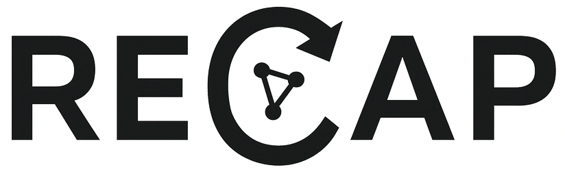

RECAP (Reproducible Experiment Capture and Provenance)
=====================================================

A scientific framework for reproducible experiment capture, tracking, and metadata management.

Overview
--------

RECAP is a Python framework that captures **experimental provenance** using a SQL database backend (via SQLAlchemy 2.0+). It provides:

- Pydantic validators  
- A DSL builder API  
- SQLAlchemy ORM persistence  
- A unified provenance graph connecting *campaigns → runs → steps → resources*

Resources
---------

In RECAP any trackable entity is called a **Resource**.

A ``Resource`` may be:

- A physical item (samples, plates, robots)
- A digital item (raw detector files, processed datasets)
- A logical item (intermediate computation results)

Resources are treated as **first-class objects**: they have identity, metadata, lineage and hierarchical structure.

Resource Hierarchy
~~~~~~~~~~~~~~~~~~

Resources may contain child resources.  
For example, a 96-well plate includes 96 wells:

::

    Plate  
     ├── A01  
     ├── A02  
     ├── …  
     └── H12  

Each child is also a Resource with its own attributes.

Example: creating a plate template with child wells:

.. code-block:: python

    with client.build_resource_template("96 Well Plate", ["container", "plate"]) as t:
        t.add_properties({
            "dimensions": [
                {"name": "rows", "type": "int", "default": 8},
                {"name": "columns", "type": "int", "default": 12},
            ]
        })

        for row in "ABCDEFGH":
            for col in range(1, 13):
                t.add_child(f"{row}{col:02d}", ["container", "well"])\
                 .add_properties({
                     "capacity": [
                         {"name": "volume_uL", "type": "float", "default": 360.0}
                     ]
                 })\
                 .close_child()

Properties and Property Groups
~~~~~~~~~~~~~~~~~~~~~~~~~~~~~~

Resources carry metadata organized into **PropertyGroup** containers.

Example: modifying well content after instantiating a plate:

.. code-block:: python

    with client.build_resource("Library Plate A", "96 Well Plate") as plate:
        for well in plate.resource.children:
            well.properties["content"].values["catalog_id"] = ""
            well.properties["content"].values["SMILES"] = ""

ProcessRun
----------

A ``ProcessRun`` captures the execution of a workflow that manipulates resources.

- Each run contains a series of **Steps**.
- Each Step contains **Parameters**.
- Resources are assigned into slots defined by the process template.
- Runs form the core provenance trail.

::

    Campaign
      └── ProcessRun
             ├── Step 1
             ├── Step 2
             └── Step 3

Campaign
--------

A **Campaign** stores the scientific context:

- Proposal identifiers
- SAF/regulatory details
- Arbitrary metadata
- All ``ProcessRun`` objects belonging to the project

Creating a campaign:

.. code-block:: python

    campaign = client.create_campaign(
        name="Beamline Proposal 4321",
        proposal_id="4321",
        saf_id="A12-7"
    )

Templates and Types
-------------------

Templates must be created before instantiating resources or process runs.

Resource Templates
~~~~~~~~~~~~~~~~~~

A ``ResourceTemplate`` defines:

- Canonical property groups
- Expected child resources
- Semantic ``ResourceType`` tags

Example:

.. code-block:: python

    with client.build_resource_template(
        "CLS3922-96", ["container", "plate", "vendor_cls3922"]
    ) as t:
        t.add_properties({
            "dimensions": [
                {"name": "rows", "type": "int", "default": 8},
                {"name": "cols", "type": "int", "default": 12},
            ]
        })

Process Templates
~~~~~~~~~~~~~~~~~

A ``ProcessTemplate`` is a multi-step workflow with slots for resources.

Example definition:

.. code-block:: python

    from recap.db.process import Direction

    with client.build_process_template("Simple Heat/Shake/Transfer", "1.0") as pt:
        pt.add_resource_slot("source", "container", Direction.input)
        pt.add_resource_slot("dest", "container", Direction.output)

        # Step 1
        pt.add_step("Heat")\
          .param_group("heat")\
          .add_attribute("temperature", "float", "C", 0)\
          .add_attribute("duration_min", "float", "min", 0)\
          .close_group()\
          .bind_slot("vessel", "source")\
          .close_step()

        # Step 2
        pt.add_step("Shake")\
          .param_group("shake")\
          .add_attribute("rpm", "int", "", 0)\
          .add_attribute("time_min", "float", "min", 0)\
          .close_group()\
          .bind_slot("vessel", "source")\
          .close_step()

        # Step 3
        pt.add_step("Transfer")\
          .param_group("transfer")\
          .add_attribute("volume_ml", "float", "mL", 0)\
          .close_group()\
          .bind_slot("from", "source")\
          .bind_slot("to", "dest")\
          .close_step()

Instantiating a ProcessRun
~~~~~~~~~~~~~~~~~~~~~~~~~~

.. code-block:: python

    with client.build_process_run(
        "Run 001",
        "Heating and shaking test run",
        "Simple Heat/Shake/Transfer",
        "1.0"
    ) as run:
        pass

Assigning resources:

.. code-block:: python

    run.assign_resource("source", tubeA)
    run.assign_resource("dest", tubeB)

Updating step parameters:

.. code-block:: python

    step = run.steps[0]
    step.parameters["heat"].values["temperature"] = 80
    step.parameters["heat"].values["duration_min"] = 5

Relating Resources, Campaigns, and Processes
--------------------------------------------

A resource enters a campaign once assigned to any process run belonging to it.

You may traverse provenance in both directions:

.. code-block:: python

    sample.campaigns
    campaign.resources
    run.resources
    resource.process_runs

Steps and Parameters
--------------------

Steps are created from ``StepTemplate`` definitions and carry param groups, for example:

.. code-block:: python

    step.parameters["heat"].values["temperature"]
    step.parameters["transfer"].values["volume_ml"]

Entity Relationships In Practice
--------------------------------

1. Model inventory using ``ResourceTemplate`` objects.
2. Define workflows using ``ProcessTemplate`` and ``StepTemplate`` objects.
3. Execute experiments by creating ``Campaign`` → ``ProcessRun`` and assigning resources.
4. Query provenance from any direction:

::

    campaign → runs → steps → parameters  
    resource → assignments → runs → campaigns

Example: End-to-End Mini Workflow
---------------------------------

.. code-block:: python

    # 1. Create template
    with client.build_resource_template("Tube", ["container"]) as t:
        t.add_properties({"dims": [{"name": "volume_uL", "type": "float", "default": 1500}]})

    # 2. Instantiate resources
    tubeA = client.create_resource("Tube A", "Tube")
    tubeB = client.create_resource("Tube B", "Tube")

    # 3. Campaign
    campaign = client.create_campaign("Buffer Prep", "BP-001", "0")

    # 4. Process template
    with client.build_process_template("Transfer 1mL", "1.0") as pt:
        pt.add_resource_slot("source", "container", Direction.input)
        pt.add_resource_slot("dest", "container", Direction.output)
        pt.add_step("transfer")\
          .param_group("p")\
          .add_attribute("volume_uL", "float", "uL", 0)\
          .close_group()\
          .bind_slot("src", "source")\
          .bind_slot("dst", "dest")\
          .close_step()

    # 5. Run
    with client.build_process_run("Run 1", "", "Transfer 1mL", "1.0") as run:
        run.assign_resource("source", tubeA)
        run.assign_resource("dest", tubeB)
        run.steps[0].parameters["p"].values["volume_uL"] = 1000

Roadmap
-------

- REST API backend  
- Web UI for campaign/process management  
- Automated execution engines  
- Integration with beamline/robot systems  
- GraphQL provenance explorer  

