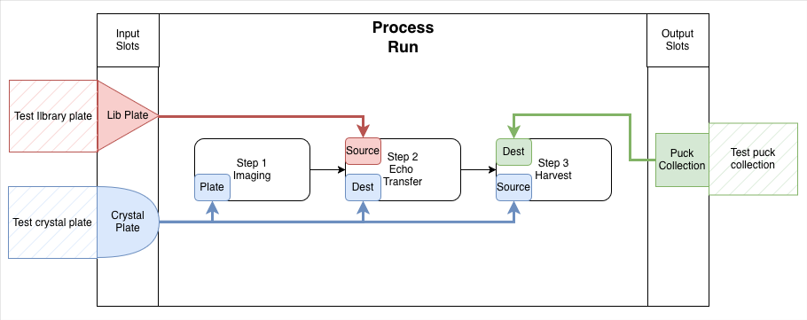

# Core Concepts

RECAP separates reusable definitions from concrete experimental records.

- **Namespace**: hierarchical ownership and authorization context.
- **ResourceTemplate**: blueprint for a resource and its properties or child
  resources.
- **Resource**: trackable physical, digital, or logical entity with identity,
  metadata, and lineage.
- **ProcessTemplate**: versioned workflow definition containing steps,
  parameters, roles, and resource slots.
- **ProcessRun**: concrete execution record connected to a process template and
  assigned resources.

Resources and process runs form a provenance graph. A process run records which
resources filled its slots and which parameters governed its steps. Downstream
queries can therefore trace outputs back through the resources and processes
that produced them.

Namespaces replace the former Campaign ownership model. Namespaces also make
visibility explicit for local queries and authenticated remote requests.
