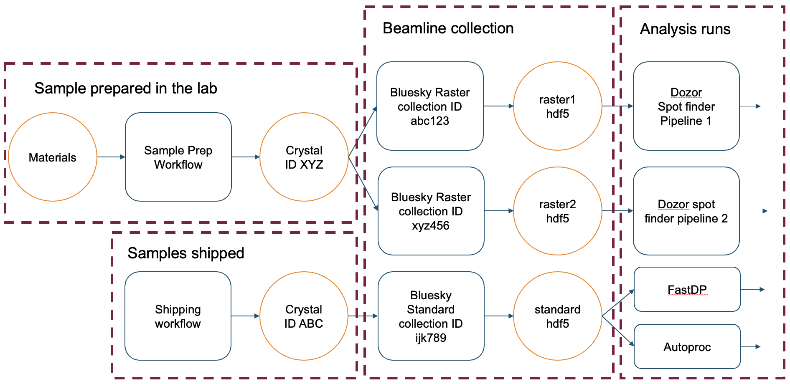
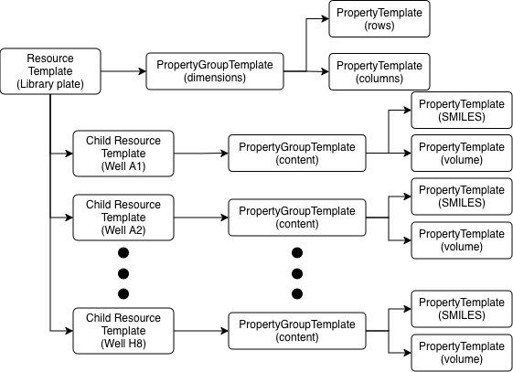
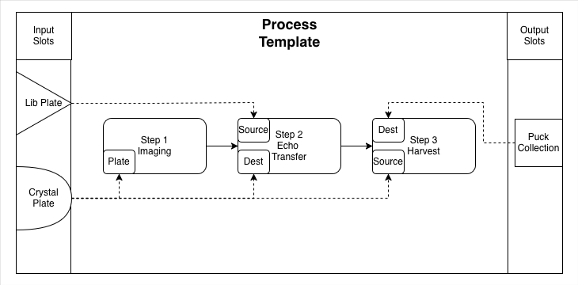

# How RECAP Organizes Data

RECAP separates definitions from instances and connects instances through a
provenance graph. This organization lets one workflow definition be reused
across many experiments while retaining the exact resources and parameters
used by each run.



The graph view is useful when a result must be traced back through the process
runs and resources that produced it.

## Namespaces

Every process run, template, and resource belongs to a Namespace. Namespaces
form a hierarchy such as:

```text
beamline
└── beamline/amx
    └── beamline/amx/proposal/312345
```

Namespace context scopes queries and writes. Namespaces also provide the
boundary used by remote authorization. A child namespace can inherit visibility
from ancestors without making sibling namespaces visible.

## Resources and resource templates

A Resource is any trackable physical, digital, or logical entity: a sample, a
plate, a detector file, an instrument, or an intermediate dataset. A
ResourceTemplate defines the structure that instances receive.

```text
ResourceTemplate: Sample Plate
├── properties: dimensions
└── children: wells
    ├── A01
    ├── A02
    └── ...
```

Child resources have their own identity, template, properties, and lifecycle
within the parent graph. The public `children` value is a dictionary keyed by
child name, so use `plate.children["A01"]` for named access and
`plate.children.values()` for iteration.



## Property groups and attributes

Resource and process templates organize values into named groups. Each
attribute declares a value type, optional unit, default, and validation
metadata.

```text
dimensions
├── rows: int = 8
└── columns: int = 12

content
├── catalog_id: str
└── volume: float [uL]
```

Property values are exposed through typed schema models. A value has both a
value and optional unit; metadata can constrain numeric ranges or enum choices.

## Process templates and runs

A ProcessTemplate is a reusable workflow definition. It contains ordered steps,
step parameters, resource slots, and role bindings. A ProcessRun is one concrete
execution of that template.

```text
ProcessTemplate: Measure Sample v1.0
├── input slot: sample
├── output slot: result
└── steps
    ├── Collect
    └── Analyze

ProcessRun: Run 001
├── sample -> Sample Plate 001
├── result -> Analysis File 001
└── parameters: values recorded for this run
```

Slots separate a workflow's interface from concrete resources. Steps bind slots
to roles such as `source`, `destination`, or `operator`, so the same template
can run with different resource instances.

## Provenance graph

Process runs connect resources into a directed provenance graph. A resource can
be an input to one run, an output of another, or reused across multiple runs
when namespace visibility and lifecycle rules permit it.

The provenance image above provides the detailed visual graph: for example,
`Sample` can flow through a `Prepare` run to a `Prepared Sample`, then through a
`Measure` run to a `Result File`. A resource may also be reused by another
process run when namespace visibility and lifecycle rules permit it.

This graph supports questions such as which sample preparation produced a
result file, which parameters governed a run, and which resources were assigned
to a workflow step.


